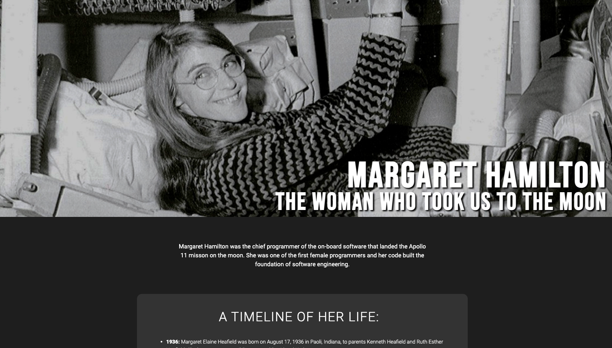

# Biography-Website
A website I created for Free Code Camp's Tribute Page project. The purpose of this project was to create a tribute page for a famous person using HTML and CSS and have the site pass FreeCodeCamp's automated tests. Emphasis was placed on formatting HTML lists and proper use of CSS flexbox.    

To view the site, <a href="https://ivanamiovcic.github.io/Biography-Website/"> click here. </a>
 
 
Details about the project can be found on <a href="https://www.freecodecamp.org/learn/responsive-web-design/responsive-web-design-projects/build-a-tribute-page"> FreeCodeCamp's website. </a> 

## Website Preview

